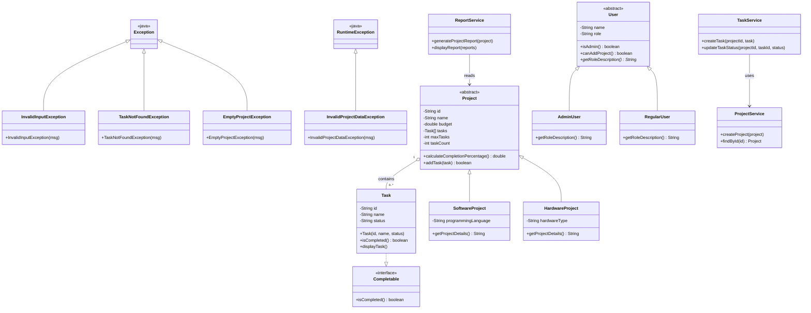

# UML Class Diagram — Task Management System

## Mermaid Diagram



---

## Inheritance Relationships

```
Object
├── Project (abstract)
│   ├── SoftwareProject
│   └── HardwareProject
└── User (abstract)
    ├── RegularUser
    └── AdminUser

Task implements Completable
```

## Association Relationships

| From | To | Relationship |
|------|----|--------------|
| `Project` | `Task` | Composition — project owns its Task[] array |
| `TaskService` | `ProjectService` | Dependency — injected via constructor |
| `ReportService` | `Project` | Association — reads project task data |
| `Main` | All Services | Uses all three services |
